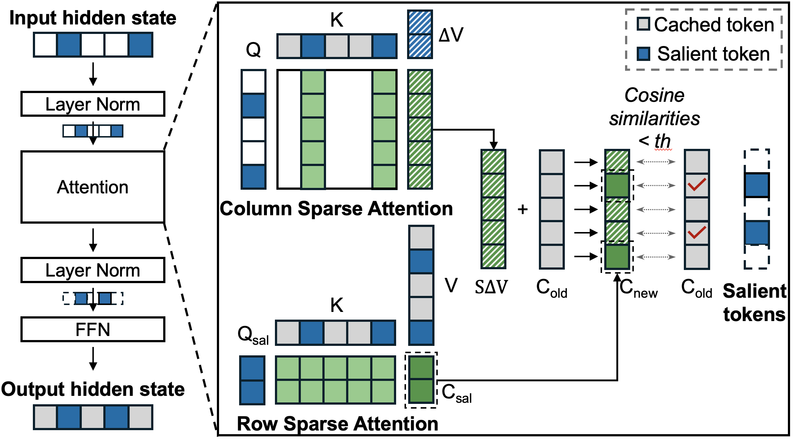
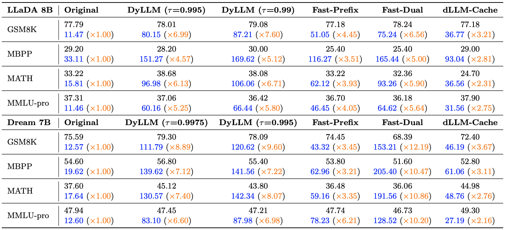
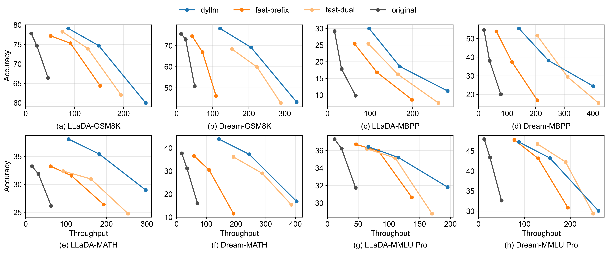

# DyLLM

DyLLM selects salient tokens after attention to remove redundant computations in FFN and use approximate attention enlightening the attention operation. Without hurting the accuracy of the original implementation, DyLLM achieve ~9.6x higher throughput.

## How to install 

```
conda create --name dyllm python=3.10 -y
conda activate dyllm
bash setup_env.sh
```

## How to run

```
python run.py
```

## Algorithm



After attention context operation, DyLLM compares the cosine similarity of context activation of each token with the same activation from the previous step.
If the similarity is smaller than the given $\tau$, the token is selected as **salient token**.
Only the salient tokens are computed in FFN significantly reducing the computational overhead.

We further reduce the runtime by focusing more on repsonse tokens. 
DyLLM basically picks salient tokens from the response tokens and attends the whole sentence periodically.


### Overall Comparison





### Commands to reproduce 

```
bash ./scripts/run_gsm8k_acc_llada.sh # accuracy test
bash ./scripts/run_gsm8k_llada.sh # throughput test
```

## Citation

If you find our code useful, please cite our paper.

```bibtex
@inproceedings{dyllm2026,
    title={Dy{LLM}: Efficient Diffusion {LLM} inference via saliency-based token selection and partial attention},
    author={Younjoo Lee and Seungkyun Dan and Junghoo Lee and Jaiyoung Park and {Jung Ho} Ahn},
    booktitle={Forty-third International Conference on Machine Learning},
    year={2026},
    url={https://openreview.net/forum?id=0azUrmsSyA}
}
```